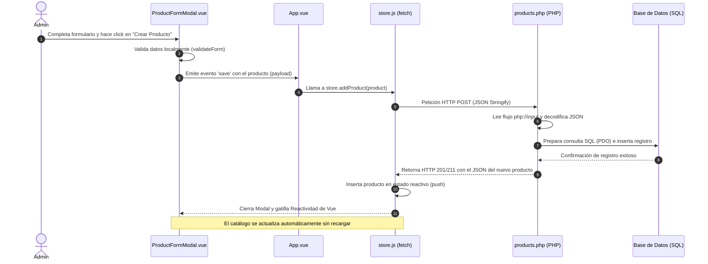

# Flujo de Carga de Productos: Vue.js ➔ PHP API ➔ MySQL/PostgreSQL

Este documento explica de manera detallada y visual el flujo de datos cuando un administrador añade un nuevo producto en la tienda de ElectroMart, desde el formulario de la interfaz de usuario hasta la inserción en la base de datos relacional.

---

## 🗺️ Diagrama del Flujo de Datos



---

## 🔍 Explicación Paso a Paso

### Paso 1: Captura del Formulario y Validación
El administrador abre el modal gestionado por el componente [`ProductFormModal.vue`](src/components/ProductFormModal.vue). Tras completar los campos obligatorios, presiona el botón de envío gatillando el método `handleSubmit()`:

1. Se invoca a `validateForm()`, que comprueba que:
   - El nombre tenga mínimo 3 caracteres.
   - El precio y el stock inicial sean válidos (mayores o iguales a cero).
   - La imagen y las especificaciones no estén vacías.
2. Si la validación es correcta, se emite el evento `save` con el objeto del producto estructurado hacia el componente padre:
   ```javascript
   emit('save', payload);
   ```

### Paso 2: Intercepción del Evento en App.vue
El componente [`App.vue`](src/App.vue) sirve como orquestador. En su plantilla declara la escucha del evento de guardado del modal:
```html
<ProductFormModal
  :isOpen="isFormModalOpen"
  @save="handleSaveProduct"
/>
```
Al dispararse, se invoca `handleSaveProduct(updatedProduct)` en la sección de control del script. Como detecta que es un producto nuevo (no tiene un ID coincidente en la lista actual), redirecciona al almacén:
```javascript
store.addProduct(updatedProduct);
```

### Paso 3: Petición Asíncrona (Fetch API) en store.js
En el archivo de estado reactivo [`store.js`](src/store.js), se define la acción `addProduct(product)` encargada del envío por red:

```javascript
async addProduct(product) {
  try {
    const response = await fetch(`${API_BASE_URL}/products.php`, {
      method: 'POST',
      headers: { 'Content-Type': 'application/json' },
      body: JSON.stringify(product) // Serialización a String JSON
    });

    if (response.ok) {
      const newProduct = await response.json();
      state.products.push(newProduct); // Mutación reactiva
      this.triggerToast(`"${product.name}" creado e insertado exitosamente.`);
    }
    // ... control de errores
  } catch (e) {
    console.error('Error de red:', e);
  }
}
```
* **Cabecera `Content-Type: application/json`**: Avisa al servidor PHP que el cuerpo del mensaje no viene cifrado como formulario clásico (`x-www-form-urlencoded`), sino como una cadena estructurada en formato JSON.

### Paso 4: Recepción y Decodificación en el Backend (PHP)
El script [`products.php`](api/products.php) intercepta las peticiones dirigidas al módulo de productos. 

1. **Detección del Método HTTP**: Identifica que el método de llamada es `POST` en el bloque condicional.
2. **Lectura del Flujo de Entrada (`php://input`)**: 
   Dado que los datos fueron enviados serializados como JSON directo en el cuerpo, no están disponibles en la variable superglobal `$_POST`. PHP debe leer directamente el canal de lectura del servidor:
   ```php
   $input = json_decode(file_get_contents('php://input'), true);
   ```
   * `file_get_contents('php://input')` obtiene la cadena de texto JSON cruda.
   * `json_decode(..., true)` convierte ese JSON en un array asociativo nativo de PHP.

### Paso 5: Serialización Técnica e Inserción SQL (PDO)
1. **Serialización del Array de Especificaciones**:
   El campo `specs` viene del frontend como una lista de strings de JS (por ejemplo: `["16GB RAM", "1TB SSD"]`). PHP codifica este array de vuelta a una cadena de texto para almacenarlo en una columna de base de datos relacional de tipo texto/JSON:
   ```php
   $specs = isset($input['specs']) ? json_encode($input['specs'], JSON_UNESCAPED_UNICODE) : '[]';
   ```
2. **Inserción mediante Sentencia Preparada**:
   Se realiza una consulta parametrizada con marcadores de posición (`:id`, `:name`, etc.) para evitar vulnerabilidades de inyección SQL:
   ```php
   $sql = "INSERT INTO products (id, name, description, price, category, image, stock, rating, specs, featured) 
           VALUES (:id, :name, :description, :price, :category, :image, :stock, :rating, :specs, :featured)";
   
   $stmt = $pdo->prepare($sql);
   $stmt->execute([
       ':id' => $id,
       ':name' => $name,
       ':description' => $description,
       ':price' => $price,
       ':category' => $category,
       ':image' => $image,
       ':stock' => $stock,
       ':rating' => $rating,
       ':specs' => $specs,
       ':featured' => $featured
   ]);
   ```

### Paso 6: Respuesta y Renderización en Tiempo Real
1. Tras ejecutar con éxito la inserción en la base de datos, PHP responde enviando un código de estado exitoso e imprime la representación del producto creado:
   ```php
   http_response_code(201); // O código de creación exitosa equivalente
   echo json_encode($input);
   ```
2. En el frontend ([`store.js`](src/store.js)), la petición asíncrona recibe el objeto y lo ingresa a la lista local usando `state.products.push(newProduct)`.
3. Gracias al sistema de **reactividad de Vue 3**, cualquier vista vinculada al catálogo (como [`CatalogView.vue`](src/components/CatalogView.vue) o [`HomeView.vue`](src/components/HomeView.vue)) detecta de manera instantánea la inserción en el array y renderiza la nueva tarjeta del producto **sin obligar al usuario a recargar la página**.
